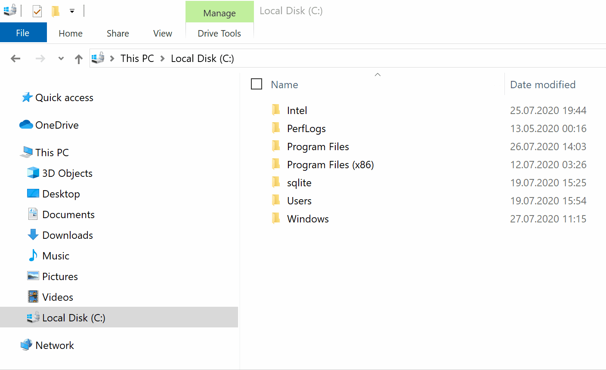
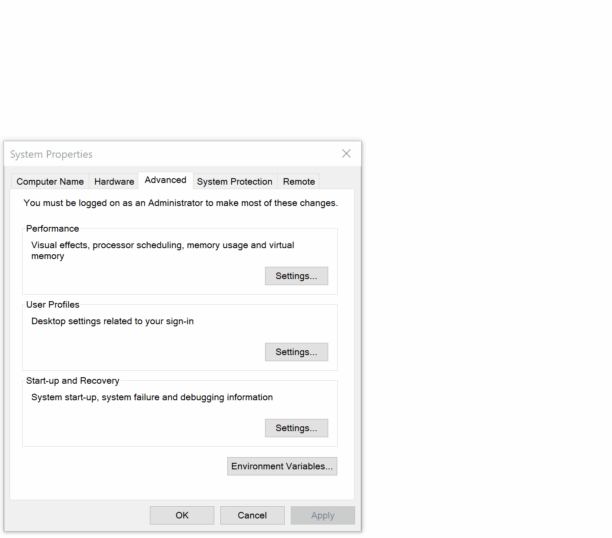
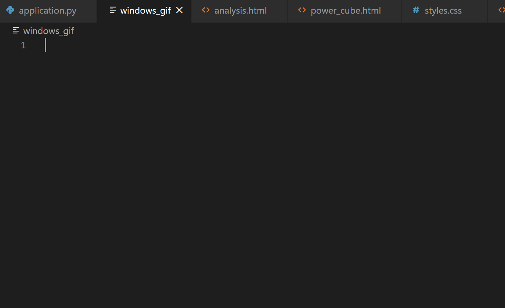
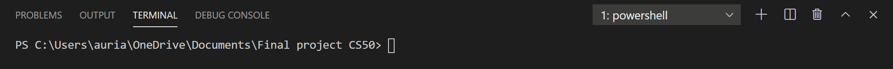
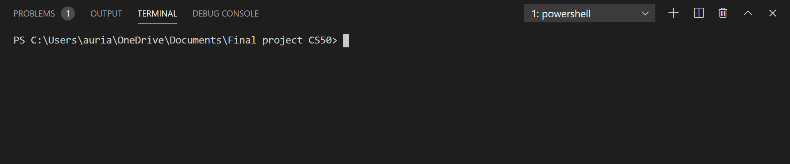

# CS50-Final-porject-Powercube-Tool

The purpose of this Flask webapp is to offer a structure that allows the user to complete its PowerCube analysis directly into a form that contains all the element of the  framework, and to render a styled document of this analysis. 

 *GIF TO COME HERE*


## Motivation

This is the final project for the CS50 class. I wanted this project to be meaningful as well as useful. So I decided to link two of my passions which are social and environmental justice with coding! In the past, I have use the power cube to analyse power dynamic created by partcipatory methods for a research project. As I was implementing this framework to my analysis, I created an excel spread sheet to save the different elements of my analysis on the same page, which would allow me to have a global vision of my work. I decided to creat this app in order to facilitate the process of analysing and having a styled result at the end.

## Built with

* Python
* Flask
* sqlite3
* HTLM / CSS / JavaScript /Bootstrap

## Getting Started !

### If you are a complete Newbie do the following step:

1. You need to download an editor, I personaly use [Visual Studio Code](https://code.visualstudio.com/?wt.mc_id=DX_841432)

2. You need to install python3

    On Windows:
    
    * Download the latest version of [Python3.x.x](https://www.python.org/downloads/)
      __make sur to tick the box ADD python 3.x.x to PATH__  before you click on Install now!
      
    * Once you have installed it, open the "Command Prompt" program (that is already in you computer, search it in the search bar :))
    * type `python` and press enter - if the instalation worked you should see something like that : 
    
        ```
        Python 3.8.5 (tags/v3.8.5:580fbb0, Jul 20 2020, 15:57:54) [MSC v.1924 64 bit (AMD64)] on win32
        Type "help" "copyright", "credits" or "license" for more information.
        ```
        
     * Still in the Command Prompt app press CTRL Z to exit python

     * Still in the Command Prompt app make sure that pip is install - type `pip -V` and press enter - if the instalation worked you should see something like this:

        ```
        pip 20.1.1 from C:\Program Files\WindowsApps\PythonSoftwareFoundation.
        Python.3.8_3.8.1520.0_x64__qbz5n2kfra8p0\lib\site-packages\pip (python 3.8)
        ```
3. You need to install sqlite3
      
     On Windows:
      
     * Go to the Sqlite [download page](https://www.sqlite.org/download.html):
      
     * In the download page go to the Precompiled Binaries for Windows - Download the 32 or 64 bit - for SQLite version 3.x.x. depending on your computer. - it will download as a zip folder
     * Go to the explorer - in Local Disck (C:) create a new foler called sqlite. Once you have created the folder, extract and copy the elements that are in the zip folder and past them in the sqlite folder you just created. You should have: qlite3.def, sqlite3.dll and sqlite3.exe files.
      
     * Now you need to add a PATH in the system environment. To do so, in your search bar search the program(already in your computer): "Edit the system environement variables". Once it is open, click on environment variable button at the bottom of the tiny window - In system variables slect PATH and edit (right picture bellow) - click on new and write the path that you can copy from the folder file (C:\sqlite - see in the left picture bellow)

<br>
 
<p align="center">
     
</p>    
<p align="center">
       
</p>

4. Now, You can set up your environment:  

    Open visual studio code:  
       
    * In the nav bar click on terminal and then new terminal. A window should appear at the bottom of the screen  
    * First we need to make sure that python is set up in the environment. To do so press ctrl+shift+P and tiny windows should open at the top of the screen like this:  
		
	<p align="center">
		
	</p>  
		
	Then:  
		
	* You can install Flask, in the terminal type: `pip install Flask` and press enter  
		

## Running the webapp in your environment!

__Download the files from the github repro and open them in visual studio__ 

On windows:  


  If you terminal runs on powershell: 
  <p align="center">
  
	</p>

  * in the terminal type `$env:FLASK_APP="application.py"` and press enter
  * still in the terminal type : `python -m flask run` and press enter
  * Flask will start running and it will provide you a link (http://127.0.0.1:5000/), when you click on it, it will redirect you to the webapp! 
  <p align="center">
  
  </p>

